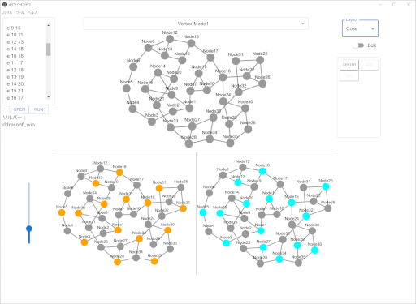

# CoReViewer
A viewer for combinatorial reconfiguration.

Windows version
https://www.algo.cce.i.kyoto-u.ac.jp/jkawahara/reconf/reconf-solver-gui-win.zip

Mac and Linux versions, and an explanation will be uploaded soon.



## Summary

This document describes the use of the GUI (graphical user interface) for the combinatorial reconfiguration solver, hereinafter referred to as the software.

## Overview

### Software overview

The GUI provides various functions for combinatorial reconfiguration problems. These functions include reading, displaying, and editing problem data, as well as running solvers for various types of problems.
The window displayed after starting the program is called the main window, and that displayed when the solver is executed is called the result window.

### Operating environment

Table 1 details the operating environment, namely, the operating system and framework required to operate the software.

|  |  |
|--|--|
| Operating system | Windows 10 of 64 bits, macOS 10.15, Ubuntu 20.04 LTS |
| Framework | Electron 16.0.0, Node.js 16.13.1 |

### Software execution

Software execution proceeds as follows:

* Place the settings files shown in the following sections in the source code directory.
* Open a console, navigate to the source code directory, and run the following command:

## Problem types

The types of combinatorial transition problems that can be solved by the software are listed below and called problem types for brevity.

### Vertex type

In the vertex problem, the transition target is a subset of the nodes in a graph. One node movement is one step of transition. For example, consider the independent set transition problem. <!-- illustrated in Figure 1.-->

### Edge type

In the edge problem, the transition target is a subset of the edges in a graph. One edge movement is one step of transition. For example, consider the spanning tree transition problem. <!--illustrated in Figure 2.-->

## File formats

The formats of each filetype used in the software are described below. The execution directory refers to both the directory directly under the source code directory created as described in the previous section,<!--section 2.5, 実行方法  Software execution,--> and the directory directly under the package directory created by executing the software as described in <!--section 6.3, 配布用パッケージの実行方法Execution of distribution package--> the following section.

###  Problem data file

The problem data file describes the data for a combinatorial transition problem. The software uses a format based on the DIMACS (Center for Discrete Mathematics and Theoretical Computer Science) format and called extended DIMACS format to represent the data. The extended DIMACS format consists of row data in the following format:

1.	p &lt;nodes&gt; &lt;edges&gt;<br>
Row representing the number of nodes and edges in the graph. Each node in the graph is assigned ID 1, 2, ..., &lt;number of nodes&gt;.
2.	e &lt;endpoint 1 node ID&gt; &lt;endpoint 2 node ID&gt;<br>
Row representing an edge. The second and third columns in the row represent the IDs of the endpoint nodes of an edge. The rows of this format appear in order with the corresponding edges assigned IDs 1, ..., &lt;number of edges&gt;.
3.	s &lt;start set element 1 ID&gt; &lt;start set element 2 ID&gt; ...<br>
Row representing the elements of the starting set. For vertex-type problems, the IDs of the nodes are specified in the starting set. For edge-type problems, the IDs of the edges are specified in the starting set. The IDs are specified as needed and separated by spaces after leading character s.
4.	t &lt;target set element 1 ID&gt; &lt;target set element 2 ID&gt; ...<br>
Row representing the elements of the target set. For vertex-type problems, the IDs of the nodes in the starting set are specified. For edge-type problems, the IDs of the edges in the starting set are specified. The IDs are specified as needed and separated by spaces after leading character t .
5.	c p &lt;node ID&gt; &lt;x-axis coordinate&gt; &lt;y-axis coordinate&gt;<br>
Row indicating the display position of a node. In the fourth and fifth columns, the x- and y-axis coordinates of the location for node ID in the third column are specified. The model position coordinates (https://js.cytoscape.org/#notation/position) in cytoscape.js are the coordinates to specify.

The following shows an example of a file in the extended DIMACS format.

```
p 3 3
e 1 2
e 2 3
e 3 1
c p 1 100 10
c p 2 10 100 
c p 3 100 100
s 2 3
t 1 2
```

The data in rows 1–4, and optionally in row 5, are called the entire problem data. The data in rows 1 and 2, and optionally in row 5, are called graph data, and the data in rows 3 and 4 are called initial and target data.

In addition to the format given by rows 1–5, data in the extended DIMACS format can include comments (rows starting with c but not followed by p) and blank lines. These rows are excluded from data loading.

### Problem list file

The problem list file describes the settings for each combinatorial transition problem handled by the software. It consists of row data in the following format:

```
<display name> <problem type name> <solver argument 1> <solver argument 2> ...
```

&lt;display name&gt; is the name of the target problem for selection in the problem selection combo box in the main window (Table 4). &lt;problem type name&gt; is the problem type to which the problem belongs, either vertex or edge. &lt;solver arguments&gt; are additional arguments passed to the solver for the target problem. Any number of &lt;solver arguments&gt; may be specified separated by spaces.

In addition to row data in the above format, the file can contain blank lines, which are excluded from the read target.

The problem list file should be placed in the execution directory under file name problem_list.csv.

The following shows an example of a problem list file.

```
Vertex-Mode1 vertex --indset --st
Edge-Mode1 edge --forest --st
Vertex-Mode2 vertex --forest --st foo
Edge-Mode2 edge --forest --st bar
```

### Solver list file

This file describes the settings of each combinatorial transition problem solver that can be used with the software. It consists of row data in the following format:

```
<solver display name> <solver placement path> <solver argument 1> <solver argument 2> ...
```

&lt;solver display name&gt; is the display name of the corresponding solver. It is used as the display name in the solver display section of the main window (Table 4) and as the item name in the solver selection combo box in the configuration window (Figure 5). &lt;solver location path&gt; is the path to the corresponding solver executable and can be either absolute or relative. If a relative path is specified, the path will be resolved relative to the execution directory. &lt;solver arguments&gt; are additional arguments passed during execution to the corresponding solver. Any number of &lt;solver arguments&gt; may be specified separated by spaces.
　In addition to the row data, the solver list file can contain blank lines, which are excluded from the read target.
　The solver list file should be placed in the execution directory under file name solver_list.csv.

The following shows an example of solver list file.

```
SolverA ./solver/solver_a.exe 
SolverB ./solver/solver_b.exe 
SolverC ./solver/test/solver_c foo bar
```

### 4.4  Software configuration file

The software configuration file contains settings applied to the entire software. It is written in the XML (Extensible Markup Language) format. A description of the element that can be specified is provided in the following table.

| Name | Tag | Description |
|------|-----|-------------|
| Solver | Solver | Specifies the display name of the solver to be used (display name shown in the next section).|

The software configuration file should be placed in the execution directory under file name config.xml. This file is read when the software starts, and its settings are applied.

The following shows an example of a software configuration file.

```
<?xml version="1.0" encoding="UTF-8" standalone="yes"?>
<solver>SolverA</solver>
```

Under construction...
